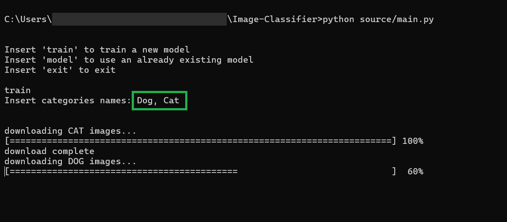
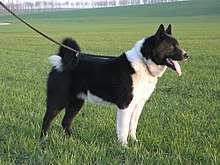

# **Image Classifier**

## Project description
**Image Classifier** is a deep learning-based project designed to classify images into predefined categories. This project uses Convolutional Neural Networks (CNNs) to identify and classify images based on their visual features. The classifier is built using Python, with libraries like TensorFlow/Keras.

With **Image Classifier** is possible to:
- Use existing models to classify images
- Train a new model, simply knowing the categories of the model 

## Installation
1. Clone the repository:
    ```bash
    git clone https://github.com/SalerSimo/Image-Classifier.git
    cd Image-Classifier
2. Install the required Python packages:
    ```bash
    pip install -r requirements.txt
## Usage
1. Open file "**launch.cmd**" or write in the command line:
    ```bash
    python source/main.py
2. Select if use an existing model or train a new model
    - Use model:
        - Select the model
    - Train new model:
        - Insert categories, 
        
            **Image Classifier** will automatically download 100 images from google for each category and will use them to train the new model

    All the models must have the following format:

        CATEGORY-1_CATEGORY-2_..._CATEGORY-N_.keras
    where ***CATEGORY-1 ... CATEGORY-N*** are the categories the image will be classified into.
3. Select the image to classify
    
## TESTS
- ### Train a new model:
    - Dog and Cat:
        
        The first test is made with DOG and CAT. I trained a new model just by inserting *Dog* and *Cat* as categories

        
        I used this image as a test:
        
        

        and the result is:
        


