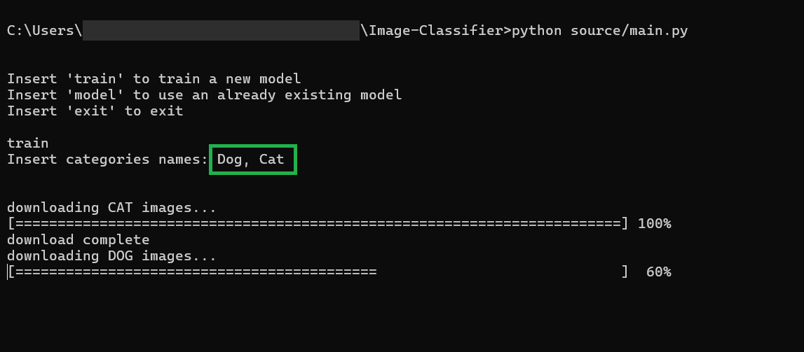
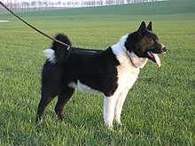
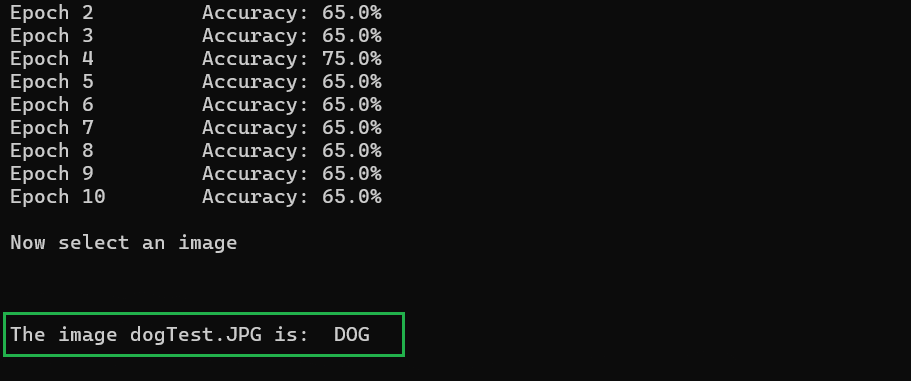

# **Image Classifier**

## Project description
**Image Classifier** is a deep learning-based project designed to classify images into predefined categories. This project uses Convolutional Neural Networks (CNNs) to identify and classify images based on their visual features.
The classifier is implemented in Python, utilizing the PyTorch library for building and training the deep learning model.

With **Image Classifier** is possible to:
- Use existing models to classify images
- Train a new model, simply knowing the categories of the model 

## Installation
1. Clone the repository:
    ```bash
    git clone https://github.com/SalerSimo/Image-Classifier.git
    cd Image-Classifier
2. Install the required Python packages:
    ```bash
    pip install -r requirements.txt
## Usage
1. Open file "**launch.cmd**" or write in the command line:
    ```bash
    python src/image_classifier.py
2. Select if use an existing model or train a new model:
    - Use model:
        - Select the model
    - Train new model:
        - Insert categories
        - Insert number of images to download for each category 

    All the models must have the following name format:

        CATEGORY-1_CATEGORY-2_..._CATEGORY-N.pth
    where ***CATEGORY-1 ... CATEGORY-N*** are the categories the image will be classified into.
3. Select the image to classify.
    
## TEST
- ### Train a new model:
    The first test is made with DOG and CAT. I trained a new model just by inserting *Dog* and *Cat* as categories:
    
    I used this image as a test:

    

    The result is:
    


